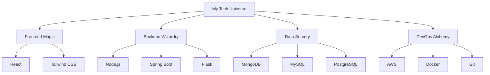

# 🚀 Alaa Abidi 🚀
Welcome to my corner of the coding universe! I'm a passionate developer who loves turning caffeine into code and ideas into reality. 
#### 👨‍💻 Full Stack Web Developer | 🧠 Data Science Enthusiast

---

## 💻 Tech Symphony 🎼

